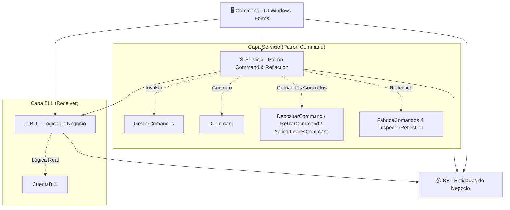
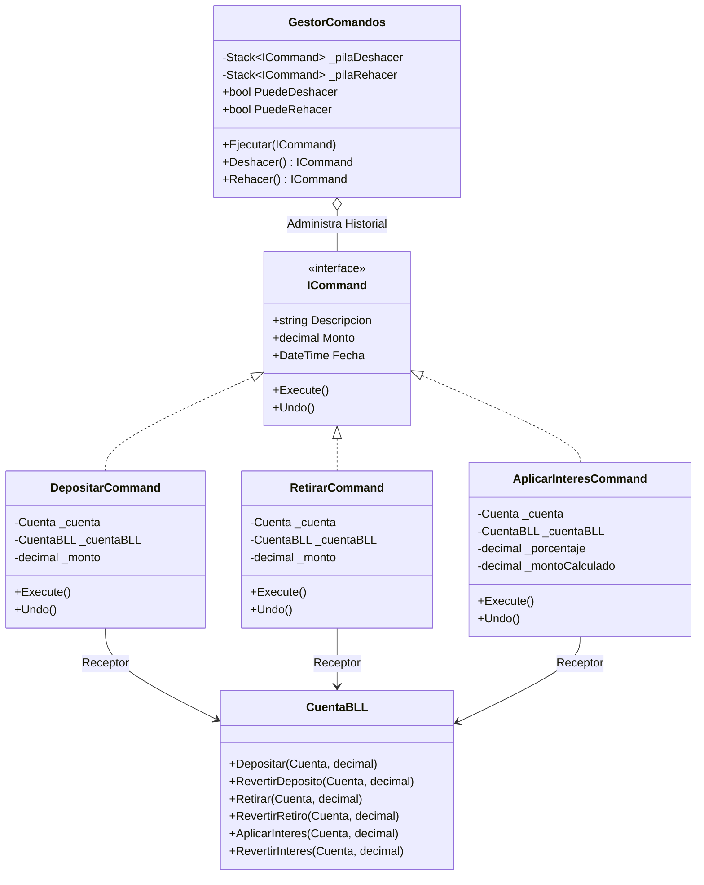

# PatronD_Command_EJ_1_Reflexion

# 💳 Sistema Bancario - Patrón Command & System.Reflection

---

## 📌 Contexto
Se requiere desarrollar una aplicación de escritorio para un **Sistema de Cuentas Bancarias y Movimientos Financieros**, aplicando una **arquitectura en capas desacoplada**, el **patrón de diseño de comportamiento Command** para el control transaccional reversible (Deshacer/Rehacer) y **System.Reflection** para el descubrimiento e introspección dinámica de componentes en tiempo de ejecución.

---

## 🎯 Requisitos del Sistema

### 1. 🏦 Gestión de Cuenta
* Cada cuenta bancaria contiene:
  * **Número de Cuenta** (Identificador único).
  * **Titular de la Cuenta**.
  * **Saldo Actual** en moneda local.

### 2. 💸 Operaciones Financieras Requeridas
* **➕ Depósito:** Incrementa los fondos disponibles en la cuenta.
* **➖ Extracción (Retiro):** Valida la existencia de fondos suficientes y descuenta el importe.
* **⭐ Bonificación / Interés (%):** Aplica un porcentaje de rendimiento sobre el saldo actual y lo acredita.

### 3. 🔄 Requerimientos del Patrón Command
* **Encapsulación de Peticiones:** Cada operación financiera debe constituir un objeto individual que implementa la interfaz `ICommand`, conteniendo la lógica de **Ejecución (`Execute`)** y **Reversión (`Undo`)**.
* **Gestor Centralizado de Historial (Invoker):** Mantiene dos pilas (`Stack<ICommand>`) en memoria para permitir las operaciones de **Deshacer (Undo)** y **Rehacer (Redo)** en cualquier momento de la sesión.
* **Desacoplamiento:** La interfaz de usuario no manipula el estado ni ejecuta reglas de negocio directamente; delega la orden a través del comando y su invocador.

### 4. 🔍 Requerimientos de System.Reflection
* **Descubrimiento Dinámico de Comandos:** El sistema escanea en tiempo de ejecución el ensamblado buscando clases que implementen `ICommand` para cargarlas en la UI sin acoplamiento estático.
* **Metadatos Descriptivos:** Uso de atributos personalizados (`[ComandoInfoAttribute]`) para consultar nombres, descripciones y tipos de parámetros requeridos.
* **Instanciación Dinámica:** Creación de comandos mediante introspección de constructores (`ConstructorInfo.Invoke`).
* **Inspector en Vivo:** Módulo de auditoría que analiza las propiedades (`PropertyInfo`) y métodos (`MethodInfo`) de cualquier objeto en memoria.

---

## 🏛️ Arquitectura en Capas

| Capa | Proyecto | Rol Arquitectónico | Rol en Patrones / Funcionalidad |
| :--- | :--- | :--- | :--- |
| **`BE`** | `BE.csproj` | **Business Entities** | Entidades de dominio (`Cuenta`, `MovimientoRegistro`). |
| **`BLL`** | `BLL.csproj` | **Business Logic Layer** | **Receiver (Receptor)** con validaciones y reglas de negocio (`CuentaBLL`). |
| **`Servicio`** | `Servicio.csproj` | **Service / Pattern Layer** | **Comandos, Invoker y Reflection** (`ICommand`, `GestorComandos`, `FabricaComandos`, `InspectorReflection`). |
| **`Command`** | `Command.csproj` | **User Interface (WinForms)** | Formulario principal (`Form1`), disparador de comandos y visor de estado/pilas. |

---

## 💻 Diagrama de Clases del Patrón Command

---
